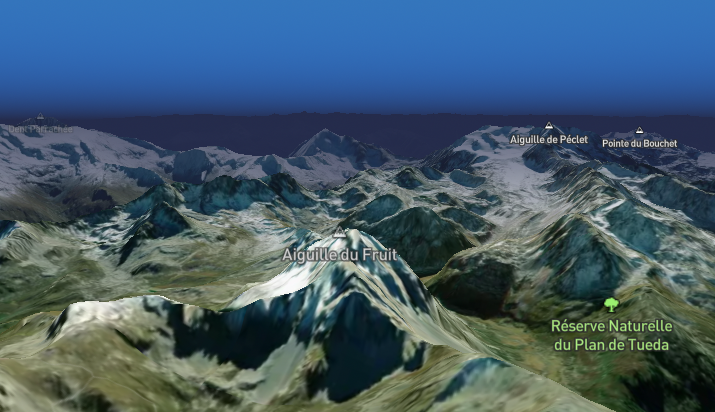

MapVue([官方文档](https://mapvue.netlify.app/)) 是一个基于 Vue3 开发的 MapboxGL 组件库，其目的在于使用更优雅的方式开发 Vue + GIS 应用。今天我们使用 MapVue 渲染一个简单的三维地形场景。

首先，初始化一个 Vue 应用，并且安装 MapVue 组件库。具体方式参考文档。

```shell
pnpm create vite@latest
```

初始化后进入项目

```shell
pnpm add mapbox-gl mapvue
```

代码如下：

```vue
<script setup>
// 这里需要你的 MapboxGL accessToken，可以存放到 .env 文件
const accessToken = import.meta.env.VITE_ACCESS_TOKEN;
</script>

<template>
  <div class="container">
    <v-map
      :accessToken="accessToken"
      :options="{
        center: [6.6301, 45.35625],
        zoom: 13,
        pitch: 80,
        bearing: 160,
        style: 'mapbox://styles/mapbox/satellite-streets-v11',
      }"
    >
      <v-fog
        color="#242B4B" 
        :range="[-1, 2]" 
        :horizon-blend="0.2" 
      />
      <v-rasterdem-source
        id="tiles"
        url="mapbox://mapbox.terrain-rgb"
        :tileSize="512"
        :maxzoom="14"
      />
    </v-map>
  </div>
</template>

<style scoped>
.container {
  height: 100vh;
  width: 100%;
}
</style>
```

整段代码使用了 `v-map`、`v-fog`、`v-rasterdem-source` 三个组件

- v-map 组件是初始化地图的最顶层组件
- v-fog 组件是加载大气环境的子组件
- v-rasterdem-source 组件是加载三维地形瓦片的子组件

效果如下：

